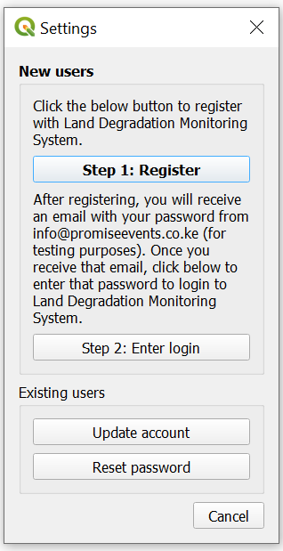
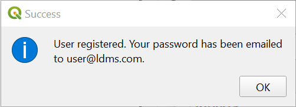

Registration and settings
=========================

.. raw:: html

    

        <video style="width: 100%; height: 100%;" controls>
            <source src="https://res.cloudinary.com/acemobile/video/upload/v1613919214/MISLAND/registration.mp4" type="video/mp4">
            Your browser does not support the video tag.
        </video>
    

.. image:: ../_static/common/plugin_toolbar_settings.png
   :align: center

.. _registration:

Registration
------------

The toolbox is free to use, but you must register an email address prior to 
using any of the cloud-based functions.

To register your email address and obtain a free account, select the highlighted
above. This will open up the "Settings" dialog box:

To Register, click the "Step 1: Register" button. Enter your email, name, 
organization and country(within North Africa region) of residence and select "Ok":

.. image:: ../_static/documentation/settings/registration.png
   :align: center

You will see a meesage indicating your user has been registered:

After registering, you will receive an email from info@promiseevnts.co.ke(for testing) with your 
password. Once you receive this email, click on "Step 2: Enter login". This 
will bring up a dialog asking for your email and password. Enter the password 
you received from info@promiseevnts.co.ke(for testing) and click "Ok":

.. image:: ../_static/documentation/settings/login.png
   :align: center

You will see a message indicating you have successfully been logged in:

.. image:: ../_static/documentation/settings/login_success.png
   :align: center

Updating your user
------------------

If you already are registered for LDMS but want to change your login 
information; update your name, organization, or country; or delete your user, 
click on "Update user" from the "Settings" dialog.

.. image:: ../_static/documentation/settings/settings_update.png
   :align: center

If you want to change your username, click on "Change user". Note that this 
function is only useful if you already have another existing LDMS 
account you want to switch to. To register a new user, see :ref:`registration`.
To change your user, enter the email and password you wish to change to and 
click "Ok":

.. image:: ../_static/documentation/settings/login.png
   :align: center

If you want to update your profile, click on "Update profile". Update your 
information in the box that appears and click "Save":

To delete your user, click "Delete user". A warning message will appear. Click
"Ok" if you are sure you want to delete your user:

Forgot password
---------------

If you forget your password, click on "Reset password" from the settings dialog 
box.

A password will be sent to your email. Please check your Junk folder if you 
cannot find it within your inbox. The email will come from info@promiseevnts.co.ke(for testing).

Once you receive your new password, return to the "Settings" screen and use 
"Step 2: Enter login" to enter your new pasword.

.. image:: ../_static/documentation/settings/forgot_password.png
   :align: center

Advanced settings
-----------------

Click "Edit advanced options" to bring up the advanced settings page:

.. image:: ../_static/documentation/settings/advanced.png
   :align: center