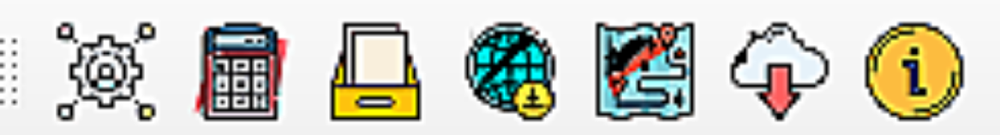

Installing the toolbox
=============================

There are different ways to install LDMS, depending on whether you want 
to install the stable version (recommended) or the development version.

Installing the development version (recommended)
------------------------------------------------
To install from within QGIS, first launch QGIS, and then go to `Plugins` in the 
menu bar at the top of the program and select `Manage and install plugins`. 

.. image:: ../_static/documentation/installing/plugin_menu.png
   :align: center

Then search navigate to Install from ZIP and upload the LDMS plugin zipfile

.. image:: ../_static/documentation/installing/install_zip.png
   :align: center

If your plugin has been installed properly, there will be a menu bar in the top 
left of your browser that looks like this:

