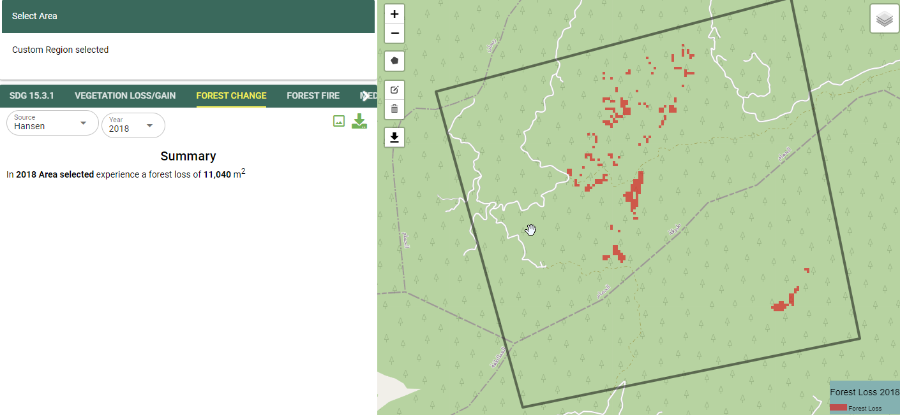

Calculate Forest Change
========================

Computing Forest Loss
_______________________

.. note::
   The current release of the MISLAND-North Africa uses the High resolution Hansen Global forest Change data to compute forest loss for selected area and year.

To compute forest loss using the Hansen Global forest change dataset;

1. On the top left conner of the Map pannel, click on the 'Draw a Polygon' tool and draw an area on the map where you wish to compute the forest loss

.. figure:: ../_static/Images/Service/draw.png
    :width: 345
    :align: center
    :height: 349
    :alt: draw polygon
    :figclass: align-center

    Draw a polygon tool

.. figure:: ../_static/Images/Service/drawarea.png
    :width: 345
    :align: center
    :height: 349
    :alt: draw polygon
    :figclass: align-center

    Draw a polygon tool

2. Select FOREST CHANGE on the service menu bar and under the 'Source dropdown' options, choose 'Hansen' and select the year you wish to compute the forest loss.

.. figure:: ../_static/Images/Service/Hansen.png
    :width: 400
    :align: center
    :height: 397
    :alt: Hansen
    :figclass: align-center

    Selecting the Hansen Forest loss data

The map and computed statistics will be displayed on the map panel and summary pannel respectively.

    Foret change outputs

Computing Forest Fires
_______________________

1. Select the FOREST FIRES option from the service menu as shown below

.. figure:: ../_static/Images/Service/forestfireselection.png
    :width: 449
    :align: center
    :height: 47
    :alt: register
    :figclass: align-center

    Selecting the Forest-fires option from the service menu.

2. On the output layer options, select the pre and post fire dates using the calender

.. figure:: ../_static/Images/Service/calender.png
    :width: 435
    :align: center
    :height: 475
    :alt: seting the pre- and post-fire dates
    :figclass: align-center

    Selecting the date from the calender tool.

.. figure:: ../_static/Images/Service/firedates.png
    :width: 438
    :align: center
    :height: 156
    :alt: register
    :figclass: align-center

    Pre-fire and Post-fire dates

3. Choose the platform to use to compute the burnt area

.. figure:: ../_static/Images/Service/platform.png
    :width: 229
    :align: center
    :height: 216
    :alt: register
    :figclass: align-center

    Choosing the Platform/Sensor for computing forest fires.

The output showing the extent and severity of the fire will be as shown below

.. figure:: ../_static/Images/Service/fireoutput.png
    :width: 793
    :align: center
    :height: 406
    :alt: register
    :figclass: align-center

    Forest-fire Output.    

.. toctree::
   :maxdepth: 3