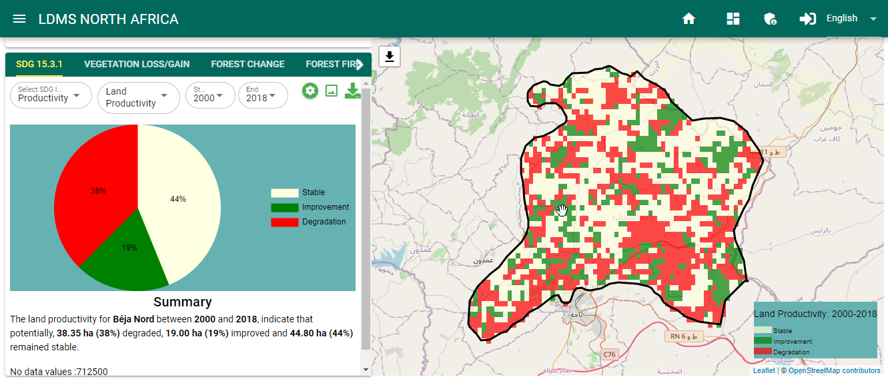
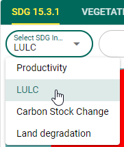
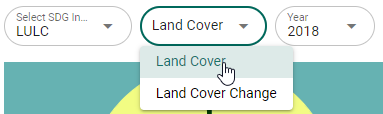
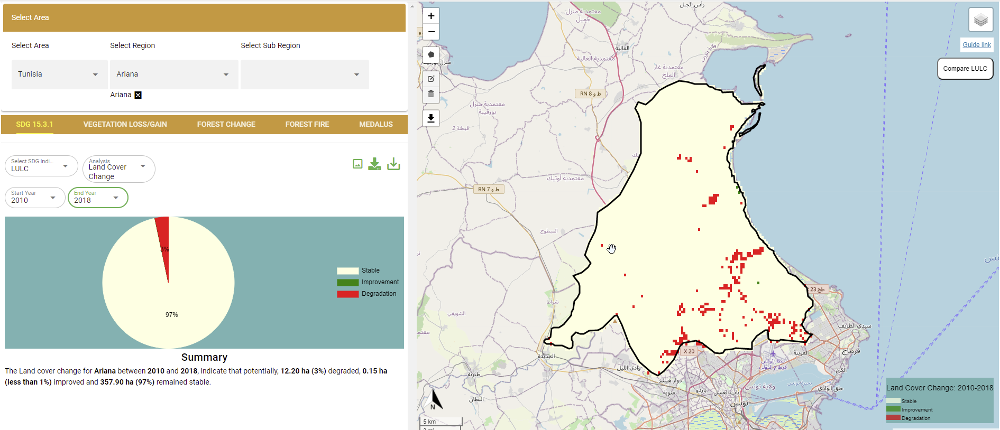
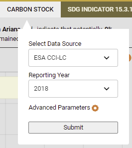

SDG 15.3.1 indicator
=====================
Compute SDG 15.3.1 Sub-indicators
___________________________________
In additin to computing the SDG 15.3.1 indicator, users of the OSS NORTH-AFRICA STATES LDMS can compute and visualize the SDG 15.3.1 sub-indicators i.e Land productivity, Landcover change, and changes in carbon stock as discussed below:

Land Productivity
~~~~~~~~~~~~~~~~~~
Land productivity is computed form vegetation indices using three measures of change i.e trajectory, state and performace. To compute land productivity on the service  platform, users can follow these simple steps

1. Select SDG 15.3.1 option on the service menu-bar and on the select SDG indicator drop-down below the service menu-bar, choose the 'Productivity' option

.. figure:: ../_static/Images/Service/productivity1.png
    :width: 287
    :align: center
    :height: 218
    :alt: finding the land productivity tool
    :figclass: align-center

    finding the Land productivity tool

2. On the next drop-down select 'Land productivity' option to conpute the Land productivity from all three measures of change: trajectory, state, and performance.

.. figure:: ../_static/Images/Service/productivity2.png
    :width: 433
    :align: center
    :height: 186
    :alt: Land_productivity
    :figclass: align-center

    Computing land productivity by combining state, trajectory and performance

.. note::
   Users may choose to compute either of the three measures of change of vegetation at this point by selecting the desired option form the list of options as shown in the figure above.

3. The results of the computations will be displayed on the map panel and summary panel as shown below

    Land productivity output 

Landcover Change
~~~~~~~~~~~~~~~~~
To compute land cover changes, users can follow these simple steps

1. Select 'SDG 15.3.1' option on the services menu-bar and, under the 'Select SDG indicator' dropdown, choose LULC as shown below

    Selecting the Land cover change under SDG 15.3.1 sub-indicators

2. To view the land cover data for a particular year, select 'Land Cover' option on the next dropdown menu followed by the year.

    Viewing the Land cover data for a particular year

The Land cover map for the chosen year and the summary statistics will be displayed on the map panel and the summary panel as shown below

.. figure:: ../_static/Images/Service/lulc3.png
    :width: 665
    :align: center
    :height: 285
    :alt: Land cover
    :figclass: align-center

    Viewing the Land cover data for a particular year

3. To compute landcover change, selec the 'Landcover change' option on the dropdown menu followed by the start and end periods for the base and comparison year.

.. figure:: ../_static/Images/Service/lulc4.png
    :width: 434
    :align: center
    :height: 133
    :alt: Land cover
    :figclass: align-center

    Selecting the Landcover change option

The results will be displayed on the map panel and the summary statistics panel as shown below

    Landcover change outputs

Carbon Stocks
~~~~~~~~~~~~~~
To compute changes in carbon stocks,

1. Select 'SDG 15.3.1' option on the services menu-bar and under the 'Select SDG indicator' dropdown, choose 'Carbon Stock Change' option and select the start year and the end year.

    Selecting the Carbon stock change SDG 15.3.1 sub-indicator

The change in carbon stock for the selected area and period will be displayed on the map panel and the summary statistics computed

.. figure:: ../_static/Images/Service/carbonstocks2.png
    :width: 650
    :align: center
    :height: 312
    :alt: Land cover
    :figclass: align-center

    Carbon stock change map and statistics

Compute SDG 15.3.1 Indicator
_____________________________
The SDG 15.3.1 Indicator combines the three sub-indicators .i.e changes in land productivity, landcover and carbon stocks discussed previously to asses the land degradation status of the selected area and period. The one-out, all-out (1OAO) approach is used to combine the results from the three sub-indicators, to assess degradation status for each monitoring period at the Indicator level. Within the study region, degradation is considered to have occurred if degradation is reported in any one of the sub-indicators.

To compute the SDG 15.3.1 indicator on the service platform, follow these simple steps,

1. Select the SDG 15.3.1 service, on the listed services menu-bar as shown below

.. figure:: ../_static/Images/sdg1.png
    :width: 790
    :align: center
    :height: 90
    :alt: SDG service
    :figclass: align-center

    SDG 15.3.1 indicator

2. On the dialog below the listed services menu, users can either compute the sub-indicators individually, or compute the land degradation from a combination of all the sub-indicators

.. figure:: ../_static/Images/sdg2.png
    :width: 202
    :align: center
    :height: 220
    :alt: sub-indicators
    :figclass: align-center

    SDG 15.3.1 sub-indicators

3. To compute SDG 15.3.1 select the Land degradation option on the 'Select SDG indicator' dropdown followed by the start and end year periods.

.. figure:: ../_static/Images/sdg3.png
    :width: 387
    :align: center
    :height: 176
    :alt: combining all indicators
    :figclass: align-center

The map and computed statistics will be displayed on the map panel and summary pannel respectively.

.. figure:: ../_static/Images/sdg4.png
    :width: 770
    :align: center
    :height: 393
    :alt: combining all indicators
    :figclass: align-center

.. toctree::
   :maxdepth: 3