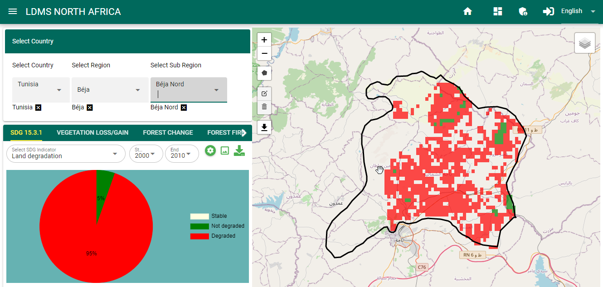
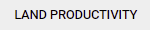
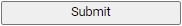
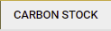

SDG 15.3.1 indicator
=====================
Compute SDG 15.3.1 Sub-indicators
___________________________________

On the Service Menu bar, users can select the |sdgicon| option which appears as the first item in the menu to compute SDG 15.3.1 indicator and its sub-indicators forllowing the steps described below:

Computing Land Productivity
~~~~~~~~~~~~~~~~~~~~~~~~~~~~
Land productivity is computed form vegetation indices using three measures of change i.e trajectory, state and performace. Any of the three sub-indicators measures of change as well as the productivity can be combuted as illustrated below

1. On the indicator menu bar that appears below the area selection panel click on the |landproductivitybutton| option. This should pop-up a selection panel as in the diagram below:

.. figure:: ../_static/Images/Service/productivity1.png
    :width: 297
    :align: center
    :height: 351
    :alt: finding the land productivity tool
    :figclass: align-center

    selecting the land productivity option

2. Under the productivity indicator option on the pop-up menu, users can select either of the three land productivity sub-indicators i.e. State, performance, and trajectory or the final aggregated land productivity for their selected area of interest.

.. figure:: ../_static/Images/Service/productivity2.png
    :width: 310
    :align: center
    :height: 355
    :alt: Land_productivity
    :figclass: align-center

    Computing land productivity by combining state, trajectory and performance

3. Complete the selection by selecting the data source and the reporting period. 

.. note::

   MISLAND allows users to asses vegetation using high resolution Landsat derived vegetation indices. If the selection of the dataset is landsat the option to specify the vegetation index .i.e NDVI, MSAVI or SAVI will appear under the |advancedparams| options.

    .. figure:: ../_static/Images/Service/productivity3.png
        :width: 297
        :align: center
        :height: 362
        :alt: Land_productivity_outputs
        :figclass: align-center

        Vegetation index selection

4. Once the selection of datasets and reporting period is complete click on the |submit| button at the pottom of the selection pop-up window to compute the selected indicator. The map and statistics should be dispalyed as shown below.

.. figure:: ../_static/Images/Service/productivity4.png
    :width: 650
    :align: center
    :height: 312
    :alt: Land_productivity_outputs
    :figclass: align-center

    Land productivity output

Computing Landcover Change
~~~~~~~~~~~~~~~~~~~~~~~~~~~~
MISLAND allows the user to view land cover state for a particular year or to compute landcover changes between two years. The landcover change
can be accessed from the |landcoverbutton| option under the SDG indicator menu as described in the steps below

1. Select |sdgicon| option on the services menu-bar and clic on the |landcoverbutton| option. This should pop up a selection panel as the one shown below

.. figure:: ../_static/Images/Service/lulc.png
    :width: 226
    :align: center
    :height: 281
    :alt: Land cover
    :figclass: align-center

    Selecting the Land cover change under SDG 15.3.1 sub-indicators

2. To view the land cover data for a particular year, select 'Land Cover' option under the `LANDCOVER ANALYSIS OPTIONS` folled by a selection of the landcover data source and the year as shown below

.. figure:: ../_static/Images/Service/lulc2.png
    :width: 224
    :align: center
    :height: 282
    :alt: Land cover
    :figclass: align-center

    Viewing the Land cover data for a particular year

Click on the |submit| button and the Land cover map for the chosen year and the summary statistics will be displayed on the map panel and the summary panel as shown below

.. figure:: ../_static/Images/Service/lulc3.png
    :width: 665
    :align: center
    :height: 285
    :alt: Land cover
    :figclass: align-center

    Viewing the Land cover data for a particular year

3. To compute landcover change, selec the 'Landcover change' option option under the `LANDCOVER ANALYSIS OPTIONS`. select the data landcover data source and the baseline and reporting year for comparison as shown 

.. figure:: ../_static/Images/Service/lulc4.png
    :width: 226
    :align: center
    :height: 297
    :alt: Land cover
    :figclass: align-center

    Selecting the Landcover change option

The results will be displayed on the map panel and the summary statistics panel as shown below

.. figure:: ../_static/Images/Service/carbonstocks2.png
    :width: 650
    :align: center
    :height: 312
    :alt: Land cover
    :figclass: align-center

    landcover change map and statistics

Carbon Stocks
~~~~~~~~~~~~~~
To compute changes in carbon stocks,

1. Select |sdgicon| option on the services menu-bar. Choose |carbonstockbutton| option and under the SDG indicator menu-bar. This should pop-up a dialog as the one shown below

.. figure:: ../_static/Images/Service/carbonstocks.png
    :width: 265
    :align: center
    :height: 297
    :alt: carbon stocks
    :figclass: align-center

    Selecting the Carbon stock change SDG 15.3.1 sub-indicator

select the data source and the reporting period and click on the |submit| button to view the carbon stock change for the selected reporting period

.. figure:: ../_static/Images/Service/carbonstocks2.png
    :width: 650
    :align: center
    :height: 312
    :alt: Land cover
    :figclass: align-center

    Carbon stock change map and statistics

Compute SDG 15.3.1 Indicator
_____________________________
The SDG 15.3.1 Indicator combines the three sub-indicators .i.e changes in land productivity, landcover and carbon stocks discussed previously to asses the land degradation status of the selected area and period. The one-out, all-out (1OAO) approach is used to combine the results from the three sub-indicators, to assess degradation status for each monitoring period at the Indicator level. Within the study region, degradation is considered to have occurred if degradation is reported in any one of the sub-indicators.

To compute the SDG 15.3.1 indicator, follow these simple steps,

1. Select the |sdgicon| service, on the services menu-bar and click on the |sdgoption| option. This should show a pop-up as the one shown below

.. figure:: ../_static/Images/Service/sdg1.png
    :width: 278
    :align: center
    :height: 296
    :alt: SDG service
    :figclass: align-center

    SDG 15.3.1 indicator

2. On the dialog that pops up, select the datasource and the reporting period. and click on the |submit| button to get the results

.. note::

   Clicking on the |advancedparams| option provides more options to select the vegetation index of choise, the ecological unit dataset and the soil organic carbon reference raster as shown below.

    .. figure:: ../_static/Images/Service/sdg2.png
        :width: 218
        :align: center
        :height: 237
        :alt: advanced options
        :figclass: align-center

        Setting advanced options for the SDG 15.3.1 indicator

The map and computed statistics will be displayed on the map panel and summary pannel respectively.

.. toctree::
   :maxdepth: 3

.. |sdgicon| image:: ../_static/Images/sdgicon.png

.. |advancedparams| image:: ../_static/Images/Service/advanceparams.png

.. |landcoverbutton| image:: ../_static/Images/Service/landcoverbutton.png
.. |sdgoption| image:: ../_static/Images/Service/sdgoption.png