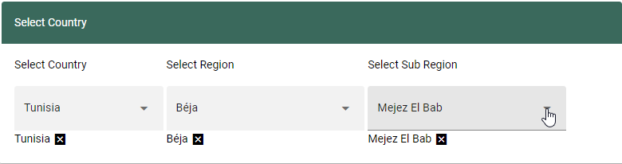
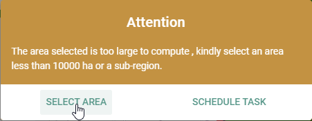
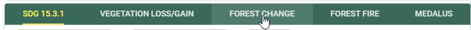

====================
Calculate Indicators
====================

SDG 15.3.1 indicators
---------------------
To compute the SDG 15.3.1 indicator on the service platform, follow these simple steps,

1. Select the SDG 15.3.1 service, on the listed services menu-bar as shown below

.. figure:: ../_static/Images/sdg1.png
    :width: 790
    :align: center
    :height: 90
    :alt: SDG service
    :figclass: align-center

    SDG 15.3.1 indicator

2. On the dialog below the listed services menu, users can either compute the sub-indicators individually, or compute the land degradation from a combination of all the sub-indicators

.. figure:: ../_static/Images/sdg2.png
    :width: 202
    :align: center
    :height: 220
    :alt: sub-indicators
    :figclass: align-center

    SDG 15.3.1 sub-indicators

3. To compute SDG 15.3.1 select the Land degradation option on the 'Select SDG indicator' dropdown followed by the start and end year periods.

.. figure:: ../_static/Images/sdg3.png
    :width: 387
    :align: center
    :height: 176
    :alt: combining all indicators
    :figclass: align-center

The map and computed statistics will be displayed on the map panel and summary pannel respectively.

.. figure:: ../_static/Images/sdg4.png
    :width: 700
    :align: center
    :height: 500
    :alt: combining all indicators
    :figclass: align-center

Vegetation Loss/Gain indicators
-------------------------------

To compute vegetation loss/gain on the service platform,

1. On the services menu, select the VEGETATION GAIN/LOSS option as shown below

    Finding the forest change service

2. If the selected region is a large area, the user will be prompted to select a smaller region. Select a smaller region on the 'Select Country' dialog on the top left conner of the dashboard

    seleting a region to compute vegetation gain/loss

.. note::
   Selection of a smaller regin optimizes the computation time and ensures that the service does not time-out. If a large area is selected, users will be notifed by a pop up on the top right conner of the site. Computation of large ares is still under development and will be available in later versions of the service.

    Pop-up notification when large area is selected.

3. Next, select the start and end period for which the vegetation loss and gain will be computed.

.. figure:: ../_static/Images/vegetation_gain_loss3.png
    :width: 350
    :align: center
    :height: 115
    :alt: vegetation gain/loss
    :figclass: align-center

    Vegetation gain/loss outputs

Forest Change
-------------
The current release of the OSS.LDMS uses ESA CCI landcover data to compute yearly changes in forest cover using the forest class.

To compute the change in forest cover on the service platform

1. On the services menu, select the FOREST CHANGE option as shown below

    Finding the forest change service

2. Selecting the forest change option will open up a dialogue below the service menu-bar. Input the start and end year to compute the forest change.

.. figure:: ../_static/Images/forestchange2.png
    :width: 600
    :align: center
    :height: 80
    :alt: register
    :figclass: align-center

    Selecting the period to compute foret change

The map and computed statistics will be displayed on the map panel and summary pannel respectively.

.. figure:: ../_static/Images/forestchange3.png
    :width: 600
    :align: center
    :height: 300
    :alt: register
    :figclass: align-center

    Foret change outputs
