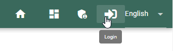
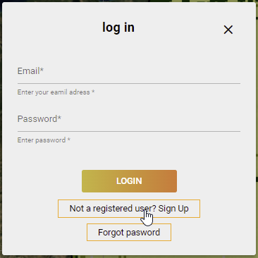
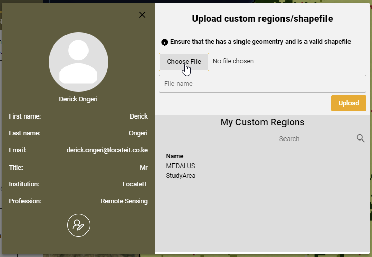

Serivice Guide
===============
MISLAND Site Tour
_____________________

.. raw:: html

   

       <video style="width: 100%; height: 100%;" controls>
           <source src="https://res.cloudinary.com/dv3id0zrx/video/upload/v1639495393/Presentation1_egnwzn.mp4" type="video/mp4">
           Your browser does not support the video tag.
       </video>
   

Registration and Log in
_________________________

New users to the service will be required to register a new account to use the service. Registering a new account is a simple two step process

1. Click on the log-in icon on the right hand side of the navigation-bar

    Finding the log in option

2. Choose the 'Not a user? Sing up' option on the log in menu that pops up

    new user registration

Registered users can proceed to log in with their Email and password.

User profile and custom uploads
__________________________________

Once loged in, users can select their profile to edit their information and for custom uploads. For custom area uploads, follow the simple steps as outlined below:

1. Click on the user-name that appears on the navingation bar items

.. figure:: ../_static/Images/profile.png
    :width: 405
    :align: center
    :height: 66
    :alt: register
    :figclass: align-center

    User profile and options

2. Click on the |choosefile| button. This should open up the file browser. 

    Selecting custom files for upload

3. Navigate to the location in which you have stored your zipped shapefile and click on the |uploadbutton|

.. |choosefile| image:: ../_static/Images/choosefile.png
.. |uploadbutton| image:: ../_static/Images/uploadbutton.png